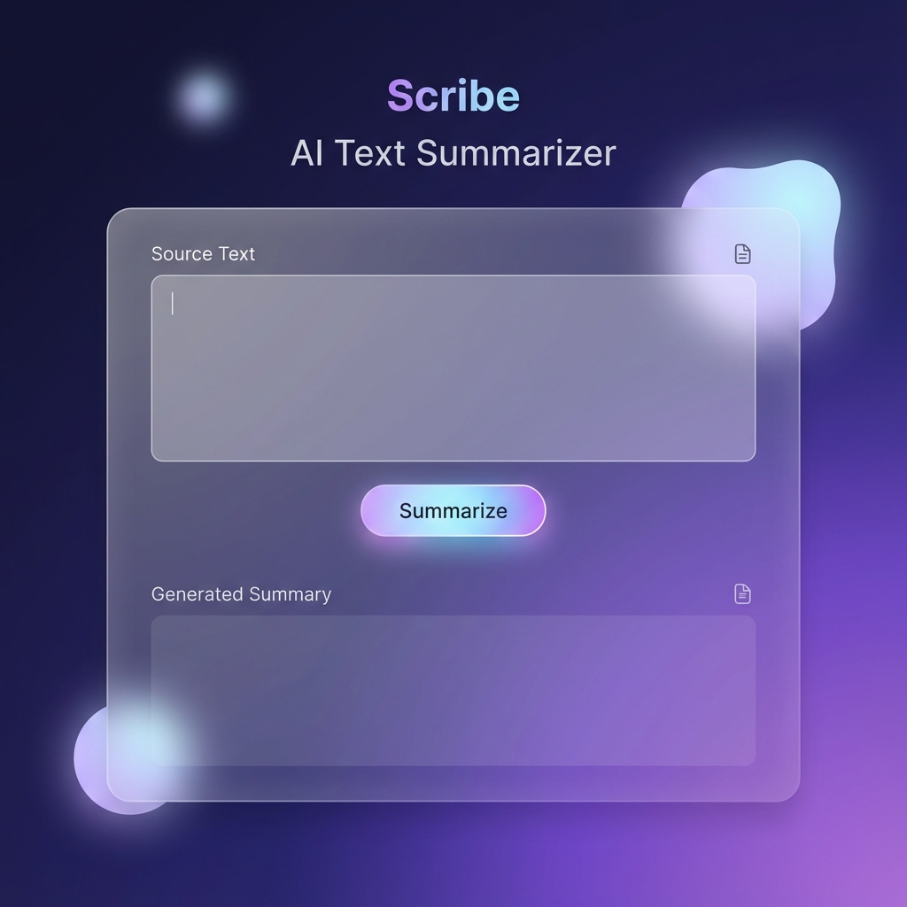

# Scribe AI: Text Summarizer Web Application

Scribe AI is a full-fledged, state-of-the-art text summarization web application designed to help users quickly distill long articles, transcripts, or notes into concise and readable summaries. Built with a modern glassmorphism UI and a robust FastAPI backend.



## 🚀 Features

- **Standard Summarization**: Uses state-of-the-art NLP models (`facebook/bart-large-cnn`) for high-quality summaries.
- **Premium UI**: Sleek, responsive, and modern design using glassmorphism aesthetics.
- **FastAPI Backend**: High-performance asynchronous API for efficient processing.
- **One-Click Summarization**: Simple and intuitive user experience.
- **Dockerized**: Ready for deployment on any cloud platform (AWS, Azure, GCP).

## 🛠️ Tech Stack

- **Backend**: Python, FastAPI, Uvicorn, Hugging Face Transformers
- **Frontend**: HTML5, Vanilla CSS, Inter Typography, Glassmorphism Design
- **Containerization**: Docker

## 📦 Getting Started

### Prerequisites

- Python 3.8 or higher
- Docker (optional, for containerized execution)

### Installation

1. Clone the repository:
   ```bash
   git clone https://github.com/shadow-warrior123/Text-Summarise.git
   cd Text-Summarise
   ```

2. Create a virtual environment:
   ```bash
   python -m venv venv
   source venv/bin/activate  # On Windows: venv\Scripts\activate
   ```

3. Install dependencies:
   ```bash
   pip install -r requirements.txt
   ```

### Running the Application

1. Start the FastAPI server:
   ```bash
   python app.py
   ```

2. Open your browser and navigate to:
   ```
   http://localhost:8080
   ```

## 🐳 Docker Deployment

To run the application using Docker:

1. Build the Docker image:
   ```bash
   docker build -t scribe-ai .
   ```

2. Run the container:
   ```bash
   docker run -p 8080:8080 scribe-ai
   ```

## 📝 License

This project is licensed under the MIT License - see the [LICENSE](LICENSE) file for details.

---
*Built with ❤️ for a modern web experience.*